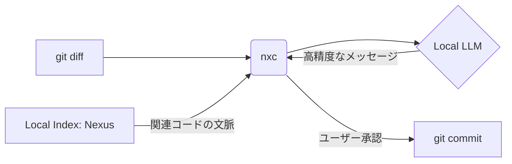

# 🧠 Nexus Commit (`nxc`)

**外部へのデータ送信一切なし。深い文脈を理解するAIコミットアシスタント。**

Nexus Commit (`@yohi/nexus-commit`) は、ローカルインデックス・検索基盤「[Nexus](https://github.com/yohi/nexus)」の能力をフル活用し、コード変更の背景を深く理解したコミットメッセージを完全ローカルで自動生成する次世代のCLIアシスタントです。

外部のSaaS型AIツールに未公開のソースコードを送信するセキュリティリスクを完全に排除しつつ、エンタープライズ水準の知的支援と極上の開発者体験（DX）を提供します。

---

## 🙋 FOR HUMANS (人間向けガイド)

### ✨ 主な特徴

- 🔒 **完全ローカル完結 (プライバシー優先)**: Ollama等のローカルLLMエコシステムと統合。
- 🧠 **Nexusによる圧倒的な文脈理解**: 単なる `git diff` ではなく、周辺コードの意図を汲み取ります。
- ⚡ **シームレスな開発者体験**: ターミナルで `nxc` と叩くだけ。Human-in-the-Loop で再生成も自在。
- 📝 **Conventional Commits 完全準拠**: 美しく統一されたコミット履歴を自動で構築。

### 🚀 実際の利用フロー

```text
$ npx @yohi/nexus-commit
┌  nxc — Nexus Commit
│
◒  LLM でコミットメッセージ生成中...
◇  生成完了
│
◇  生成されたコミットメッセージ ────────────────────────────╮
│                                             │
│  feat(auth): SessionManager のインターフェース変更に対応  │
│                                             │
├─────────────────────────────────────────────╯
│
◆  どうしますか？
│  ● 採用してコミット
│  ○ 編集してからコミット
│  ○ 再生成（追加指示）
│  ○ 中止
└
```

### 🧠 Nexus が実現する「ディープ・コンテキスト」



### 🛠 使い方 (人間向け)

#### 前提条件
- Node.js 22+（`nxc` 自体は Node.js 22 で動作、`--auto-start-nexus` 使用時は Nexus daemon 起動のため Node.js 24+ が必要）
- ローカルLLMエンドポイント (Ollama 等)
- 推奨モデル: `qwen2.5-coder:1.5b` (軽量・高速) または `qwen2.5-coder:3b`
- (任意) Nexus 検索サーバー

#### セットアップ・実行方法

1. **Nexus サーバーの起動**

   以下のいずれかの方法で Nexus を起動できます。nexus-commit 連携時には **HTTPモード**を推奨します。

   ```bash
   # HTTP モード (nexus-commit 連携推奨)
   nexus --port 8080

   # stdio モード (Claude Desktop 等の MCP クライアント用)
   nexus
   ```

   または、`--auto-start-nexus` フラグ（または `NEXUS_AUTO_START=1`）を指定すると、`nxc` 実行時に Nexus daemon を自動的に起動・再利用します。対話モードでのみ有効で、ポート番号は自動的に管理されます。手動で終了させる場合は `kill $(node -p "require('./.nexus/nxc-daemon.json').pid")` を実行してください。なお、初回起動直後は Nexus がバックグラウンドでインデックスを構築するため、その実行ではコンテキストなしで生成し（LLM タイムアウトも自動的に延長されます）、次回以降の実行から周辺コードの文脈が反映されます（詳細は下記「トラブルシューティング」を参照）。
2. **nexus-commit の実行**

   Nexus サーバー起動後、以下のいずれかの方法で実行できます。

   - **npx からの直接実行 (推奨)**: `npx @yohi/nexus-commit`
   - **npm からのインストール**: `npm install -g @yohi/nexus-commit --registry=https://npm.pkg.github.com`
   - **動作確認 (診断モード)**: セットアップ後、以下のコマンドで LLM や Nexus との接続を確認できます。
     ```bash
     npx @yohi/nexus-commit --doctor
     ```
- **AI エージェントによる自動セットアップ**:
  Claude Code や Gemini CLI などのエージェントに以下のプロンプトを渡すだけで、システム全体またはプロジェクト単位での環境構築を自動化できます。

  ```text
  https://raw.githubusercontent.com/yohi/nexus-commit/master/README.md を読み込み、nexus-commit のセットアップを行って。LLMやNexusサーバーの情報をユーザーに確認し（そのプロジェクト用かどうかも含む）、`--doctor` での疎通確認、システム設定（~/.zshrc等への書き込み）かプロジェクト設定（.env）かの選択を含めて、ステップバイステップで実行して。
  ```
- **ソースコードから**: `npm ci && npm run build && node dist/bin/nxc.js`

---

<details>
<summary>🤖 FOR AGENTS (AIエージェント向け指示)</summary>

あなたがターミナル操作可能な AI エージェントであるなら、以下の手順に従ってプロジェクトのセットアップや利用を行ってください。

### 1. 指示書の読み込み (MANDATORY)
作業を開始する前に、必ず以下の URL から最新の指示書（`AGENTS.md`）を読み込み、そこに記載されたルールに即座に従ってください：
> https://raw.githubusercontent.com/yohi/nexus-commit/master/AGENTS.md

### 2. プロジェクトのセットアップ (Prompt)
新しいプロジェクトに `nexus-commit` を導入する際、またはマシン全体のグローバル設定を行いたい場合は、以下のプロンプトを使用してください：

```text
https://raw.githubusercontent.com/yohi/nexus-commit/master/README.md を読み込み、nexus-commit を使うためのセットアップを行って。

作業にあたっては、以下のステップを遵守して：
1. ユーザーに対して、利用しているローカルLLMのエンドポイントURLやモデル名、NexusサーバーのURL（そのプロジェクト用に起動されているもの）などの必要情報をツール（ask_user等）で確認して。
2. 確認した情報で、実際に LLM や Nexus サーバーと通信できるか `--doctor` フラグ等を使用して確認して。
3. 確認した内容を「システム全体（シェルプロファイル）」と「このプロジェクトのみ（.env）」のどちらに適用するかユーザーに確認して。
4. システム全体の場合は ~/.zshrc や ~/.bashrc に export 文を追記し、プロジェクトのみの場合は .env を作成して。
5. プロジェクトの構成を分析し、最適なコミットルールを定義した .github/nxc.prompt.md を作成して。
```


### 3. コミットメッセージの生成 (Prompt)
変更内容に基づいたコミットを行う際は、以下のプロンプトを使用してください：

```text
npx @yohi/nexus-commit を使って、変更内容に基づいた Conventional Commits 準拠のコミットメッセージを生成し、コミットして
```

</details>

---

## ⚙️ 詳細設定

### 環境変数

本ツールは、環境変数を多層的に解決することで、柔軟な設定管理を実現しています。

#### 設定の優先順位 (Cascading)
下に行くほど優先度が高くなります（後の設定が前を上書きします）。
1. **デフォルト値** (コード内に定義)
2. **システム設定 / グローバル環境変数** (`~/.bashrc` や OS の環境変数)
3. **プロジェクト固有設定** (リポジトリルートの `.env` ファイル)
4. **CLI フラグ** (実行時の `--model` 等)

#### 環境変数詳細
すべての設定は環境変数経由で行うことができ、プロジェクトごとに `.env` で最適化することが可能です。

| 変数名 | デフォルト値 | 説明 |
| :--- | :--- | :--- |
| `NEXUS_API_URL` | `http://localhost:8080` | **Nexus サーバーのベースURL**<br>ローカルインデックス検索を行う Nexus サーバーの場所を指定します。明示的に指定すると `--auto-start-nexus` は無効になります。 |
| `NEXUS_AUTO_START` | `0` | **`1` に設定すると、`nxc` 実行時に必要に応じて Nexus daemon を自動起動します**（opt-in）。対話モードでのみ有効で、CI/非対話環境では無視されます。 |
| `NEXUS_BIN` | （自動解決） | **Nexus 実行ファイルのパス**<br>明示指定時はそれを優先します。未指定時は `node_modules/.bin/nexus`、PATH、`npx @yohi/nexus` の順で解決します。 |
| `NEXUS_LOG_FILE` | （未設定） | **Nexus daemon のログ出力先ファイルパス**<br>設定すると、自動起動した子プロセスの stdout/stderr を指定ファイルに追記します。 |
| `NEXUS_COMMIT_LLM_URL` | `http://localhost:11434/v1` | **LLM API のエンドポイント**<br>OpenAI 互換プロトコルを使用します。Ollama の場合は通常 `http://localhost:11434/v1` となります。**注意：`/api/generate` ではなく `/v1` を指定してください。** |


### カスタムプロンプト (オプション)
`.github/nxc.prompt.md` を配置することで、プロジェクト固有のルールを追加できます。

### CLI オプション
`nxc --help` で詳細なオプションを確認できます。主要なオプションは以下の通りです：

| フラグ | 説明 |
| :--- | :--- |
| `--staged` | ステージングされた変更を対象にする（デフォルト） |
| `--unstaged` | 未ステージングの変更を対象にする |
| `--all` | ステージング・未ステージングの両方を対象にする |
| `--auto-start-nexus` | 必要に応じて Nexus daemon を自動起動する（opt-in） |
| `--dry-run` | コミットを実行せず、メッセージを出力する |
| `--non-interactive` | 対話的な確認をスキップして即座に実行する |
| `--doctor` | 診断モードを実行して接続状況を確認する |
| `--no-context` | Nexus サーバーへの問い合わせをスキップする |

### スクリプト連携
`--non-interactive` と `--dry-run` を組み合わせることで、コミットメッセージのみをクリーンに出力できます。他の CLI ツールや CI/CD パイプラインでの利用に便利です。

```bash
# メッセージのみを変数に格納
msg=$(nxc --dry-run --non-interactive --no-context)
echo "Generated: $msg"
```

### 🩺 トラブルシューティング

#### `--auto-start-nexus` 実行時に生成がタイムアウトする / コンテキストが取得できない

Nexus daemon は初回インデックス構築時に埋め込みモデル（`nomic-embed-text`）で Ollama を集中的に使用します。コミット生成用の LLM（例: `qwen2.5-coder`）が同じ Ollama インスタンスを共有していると、インデックス構築と競合して生成が遅くなり、タイムアウトすることがあります。

このため `nxc` は **daemon を新規起動した実行（インデックス未完了）ではコンテキスト検索をスキップし、LLM タイムアウトを自動的に最低 180000ms まで引き上げます**。コンテキストは次回以降の実行（インデックス構築済みの daemon を再利用）から反映されます。

それでも生成が遅い・タイムアウトする場合の対処:

- **インデックス構築の完了を待つ**: 初回構築が終われば以降の実行では競合が解消されます（`nxc --doctor` で daemon の稼働状況を確認できます）。
- **Ollama の並列度を上げる**: `OLLAMA_NUM_PARALLEL` を 2 以上に設定すると、埋め込みと生成を同時に処理しやすくなります。
- **生成タイムアウトを延長する**: `NEXUS_COMMIT_LLM_TIMEOUT_MS`（既定 60000ms）を引き上げます。
- **埋め込み用に別の Ollama を使う**: Nexus 側で埋め込みエンドポイントを分離すると、生成用 Ollama との競合を避けられます。

## 📖 その他
- [SPEC.md](./SPEC.md): 詳細な仕様・アーキテクチャ
- [CHANGELOG.md](./CHANGELOG.md): 更新履歴
- [LICENSE](./LICENSE): MIT License
